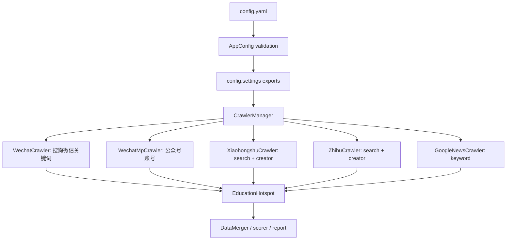

# 搜索源扩展与 TrendCrawlerRuntime 外置设计

日期：2026-05-10

## 背景

当前项目的搜索入口已经集中在 `CrawlerManager`，采集结果统一进入 `EducationHotspot`、`DataMerger`、评分和 Markdown 报告链路。现有代码里有两个不一致点：

- `crawlers/manager.py` 已经认识 `wechat`、`wechat_mp`、`xiaohongshu`、`zhihu`、`general`。
- `config/app_config.py` 的 `SUPPORTED_SOURCES` 只允许 `wechat_mp`、`xiaohongshu`、`zhihu`，导致 `wechat` 和通用搜索不能通过 `config.yaml` 正常启用。

目标是把项目整理成一个可迁移、可自用部署的搜索软件，主打“关键词搜索 + 账号采集”。

## 目标

- 支持微信关键词搜索：`wechat`，使用搜狗微信搜索。
- 支持微信公众号指定账号采集：`wechat_mp`，继续使用微信公众平台后台。
- 支持小红书关键词搜索和指定账号采集：`xiaohongshu`。
- 支持知乎关键词搜索和指定账号采集：`zhihu`。
- 支持通用关键词搜索：`google_news`，迁移 `/Users/neo/Desktop/知识库建设/google_news.py` 里有价值的 Google News 搜索能力。
- 保持迁移方式简单：`.env` 放密钥和机器差异，`config.yaml` 放业务配置。
- 整理 `TrendCrawlerRuntime` 依赖，避免运行时目录和业务层边界混在一起。

## 非目标

- 第一版不做“按昵称搜索账号后自动选择账号”。小红书和知乎的账号采集必须配置确定的主页 URL 或 ID，避免重名和误采。
- 第一版不引入 Bing API。通用搜索只做 `google_news`。
- 第一版不做大规模抓取调度、代理池、分布式任务、数据库后台。
- 不修改评分、日报模板和 longxia candidate 导出逻辑，新增源只要输出标准 `EducationHotspot`。

## 推荐架构



继续使用一个 `source` 对应一个平台 crawler 的方式。平台内部支持关键词和账号两种输入，而不是拆成 `xiaohongshu_keyword`、`xiaohongshu_account` 这种碎 source。

## 配置形状

```yaml
enabled_sources:
  - wechat
  - wechat_mp
  - xiaohongshu
  - zhihu
  - google_news

wechat:
  keywords:
    - 教育改革
  max_results_per_keyword: 8
  use_playwright: true
  fetch_detail_page: false

wechat_mp:
  accounts:
    - 中国教育报
  max_articles_per_account: 5

xiaohongshu:
  keywords:
    - 中考
  creator_urls:
    - https://www.xiaohongshu.com/user/profile/5f58bd990000000001003753?xsec_token=...&xsec_source=pc_search
  max_results_per_keyword: 20
  max_results_per_account: 20
  login_type: qrcode

zhihu:
  keywords:
    - 教育改革
  creator_urls:
    - https://www.zhihu.com/people/yd1234567
  max_results_per_keyword: 20
  max_results_per_account: 20
  login_type: qrcode

google_news:
  keywords:
    - 教育改革
  max_results_per_keyword: 20
  period: 7d
  language: zh-CN
  country: CN
```

`.env` 只保留运行环境和密钥：

```env
LLM_API_KEY=
LLM_BASE_URL=
LLM_MODEL=
SOGOU_WECHAT_COOKIE=
XIAOHONGSHU_COOKIE=
ZHIHU_COOKIE=
GOOGLE_NEWS_PROXY_URL=
TREND_CRAWLER_RUNTIME_PYTHON_BIN=
```

## 小红书账号采集

`TrendCrawlerRuntime` 已支持 `--type creator`，并且命令行参数 `--creator_id` 会在小红书平台写入 `config.XHS_CREATOR_ID_LIST`。当前 `XiaohongshuCrawler` 只调用 `--type search`，需要扩展为：

- 有 `keywords` 时执行 search。
- 有 `creator_urls` 时执行 creator。
- 两种都配置时顺序执行，并从最新的 `search_contents_*.jsonl` 和 `creator_contents_*.jsonl` 读取结果。

小红书账号采集只把完整主页 URL 作为支持口径。纯 user_id 虽然本地解析函数支持，但缺少 `xsec_token`，第一版不承诺稳定抓取；开源文档要写清楚这一点。

## 知乎账号采集

`TrendCrawlerRuntime` 代码中有 `ZhihuCrawler.get_creators_and_notes()` 和 `config.ZHIHU_CREATOR_URL_LIST`，但命令行 `--creator_id` 当前没有把 `zhihu` 映射到 `ZHIHU_CREATOR_URL_LIST`。实现有两个选择：

- 方案 A：修改 `TrendCrawlerRuntime/cmd_arg/arg.py`，让 `--creator_id` 在 `platform == zhihu` 时写入 `config.ZHIHU_CREATOR_URL_LIST`。
- 方案 B：在外层 wrapper 临时改写 `TrendCrawlerRuntime/config/zhihu_config.py`。

推荐方案 A。它是很小的补丁，职责清楚，并且以后所有 `TrendCrawlerRuntime` 命令行调用都一致。方案 B 会写运行时配置文件，容易污染工作区。

## Google News 通用关键词搜索

从 `/Users/neo/Desktop/知识库建设/google_news.py` 只迁移三部分：

- `GNews(language, country, period, max_results)` 关键词搜索。
- Google News 跳转链接解析成原始 URL。
- 搜索结果标准化为 `EducationHotspot`。

不迁移以下内容：

- 不迁移硬编码代理。
- 不迁移本地 `http://127.0.0.1:5000/insert` 入库逻辑。
- 不迁移知识库项目里的 Bing 内容抽取依赖。

新增依赖只需要 `gnews`。代理通过 `GOOGLE_NEWS_PROXY_URL` 注入到 `http_proxy` 和 `https_proxy`，不配置时直接请求。

## TrendCrawlerRuntime 外置设计

当前 `TrendCrawlerRuntime` 是被 Git 直接跟踪的普通目录，不是 submodule。目录体积较大，如果继续和业务代码强绑定，会带来三个问题：

- 仓库体积大。
- 运行时和业务层边界不清楚。
- 后续迁移、部署和历史清理成本更高。

推荐把 `TrendCrawlerRuntime` 外置为“运行时依赖目录”，而不是复制进主仓库：

```text
AITrend/
  crawlers/
  config/
  scripts/
  third_party/          # gitignored
    TrendCrawlerRuntime/       # bootstrap clone or user-provided path
```

配置默认改成：

```yaml
trend_crawler_runtime:
  dir: ./third_party/TrendCrawlerRuntime
```

`scripts/bootstrap.py` 负责：

- 如果 `trend_crawler_runtime.dir` 已存在，安装它的 requirements。
- 如果不存在，提示用户放置兼容的 TrendCrawlerRuntime，或在用户同意执行时初始化到 `third_party/TrendCrawlerRuntime`。
- 报告登录态位置从 `TrendCrawlerRuntime/browser_data` 改为 `third_party/TrendCrawlerRuntime/browser_data`。

如果要保留同一个 Git 历史，只删除当前目录不会让历史里的大体积运行时消失。对外发布时建议新建干净仓库，或用历史重写工具清掉旧运行时历史。这个动作应独立于搜索功能实现，避免把业务改动和仓库历史治理混在一起。

## 文件变更范围

预计修改：

- `config/app_config.py`：新增 `wechat`、`google_news` 配置模型；扩展 `xiaohongshu`、`zhihu` 的账号字段；更新校验。
- `config/settings.py`：把新增配置导出为 settings 常量。
- `crawlers/manager.py`：把 `general` 替换或并列新增 `google_news`。
- `crawlers/wechat.py`：从 `config.yaml` 读取搜狗微信参数。
- `crawlers/xiaohongshu.py`：支持 search + creator 两种模式。
- `crawlers/zhihu.py`：支持 search + creator 两种模式。
- `crawlers/google_news.py`：新增 Google News crawler。
- `TrendCrawlerRuntime/cmd_arg/arg.py`：补齐 `zhihu` 的 `--creator_id` 映射。
- `requirements.txt`：新增 `gnews`。
- `scripts/bootstrap.py`：适配外置 `TrendCrawlerRuntime` 路径。
- `config.yaml.example`、`.env.example`、`README.md`：更新迁移和登录说明。
- `tests/`：补配置校验、settings 导出、Google News 转换、小红书/知乎命令构造测试。

预计删除或迁移：

- 第一阶段不删除 `TrendCrawlerRuntime/`，先让新配置支持外置路径。
- 第二阶段对外发布前评估是否保留运行时目录，必要时创建干净仓库。

## 验收标准

- `python -m pytest tests/test_app_config.py tests/test_settings.py tests/test_bootstrap.py -q` 通过。
- 新增 Google News 单测不触网，通过 mock 输入生成标准 `EducationHotspot`。
- 小红书配置同时包含 `keywords` 和 `creator_urls` 时，wrapper 会分别构造 `--type search` 和 `--type creator` 命令。
- 知乎配置 `creator_urls` 时，wrapper 会构造 `--type creator --creator_id ...`，并且 `TrendCrawlerRuntime` 命令行能把 creator 列表映射到 `ZHIHU_CREATOR_URL_LIST`。
- `python main.py search --sources wechat,google_news` 能从配置读取关键词。
- README 明确账号采集必须使用主页 URL/ID，不承诺昵称自动解析。

## 风险

- Google News 在国内网络环境依赖代理，README 要写清楚 `GOOGLE_NEWS_PROXY_URL`。
- 小红书账号 URL 缺少 `xsec_token` 时不属于第一版支持口径，文档必须要求从网页登录后的账号主页复制完整 URL。
- 修改 `TrendCrawlerRuntime/cmd_arg/arg.py` 属于运行时补丁。外置之后如果替换运行时目录，需要同步保留这处小补丁。
- 删除内嵌 `TrendCrawlerRuntime` 会影响当前登录态路径，必须在 README 说明登录态不可迁移或需要重新登录。
