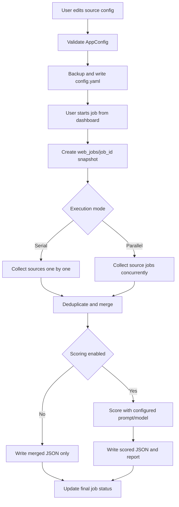

# AITrend Web Dashboard Design

## Goal

Build a polished blue/white/gray web dashboard for AITrend so an operator can configure source inputs, run collection jobs, watch per-source and per-keyword/account progress, and optionally run LLM scoring from a dedicated scoring configuration page.

The dashboard must preserve the current CLI workflow and `config.yaml` authority. It adds a web operator surface on top of existing collection, merge, scoring, and report logic.

## Current Code Facts

- `main.py` has three commands: `search`, `run`, and `start`. `search` collects and writes merged JSON; `run` collects, merges, scores, writes scored JSON, generates a Markdown report, and optionally exports longxia candidates.
- `config/app_config.py` defines supported business sources: `wechat`, `wechat_mp`, `xiaohongshu`, `zhihu`, `google_news`, and `aihot`.
- `config/settings.py` loads business configuration from `config.yaml`; secrets and machine-local values such as `LLM_API_KEY` currently come from `.env`.
- `CrawlerManager.collect_all()` currently executes sources sequentially and supports per-source keyword/account/time-range overrides, but result limits are still loaded through configuration-derived constants in crawler modules.
- `scorers/scorer.py` currently hard-codes the scoring prompt inside `_score_single_item()`.

## Product Shape

### Navigation

Use a top navigation bar with the following pages:

- `主工作台`
- `来源配置`
- `打分模型`
- `任务历史`
- `结果报告`
- `系统状态`

The visual direction is blue/white/gray, similar to a high-end internal SaaS console:

- White translucent cards on a very light gray-blue background.
- Subtle technical grid background.
- Blue primary actions and active navigation.
- Green for success, amber for low expected count, red for failures, gray for disabled/pending.
- Dense but not cramped information hierarchy.

### Main Dashboard

The main dashboard is for running and observing jobs. It must not become a giant configuration form.

It shows:

- Current enabled-source summary.
- Global default summary: 7 days, expected minimum 3 items, maximum 10 items.
- Collection mode: `只采集` or `采集 + 打分 + 报告`.
- Execution mode: `并行` or `串行`.
- A run button.
- Source progress cards.
- Keyword/account-level progress bars inside each source card.
- Event log tail.
- Output artifact summary.

Each source card has a `配置` button that jumps to that source section in the source configuration page.

### Source Configuration

The source configuration page owns what to collect. Saving writes back to the repository root `config.yaml` as the default configuration.

Saving rules:

- Save only when the user clicks `保存为默认配置`.
- Validate with `AppConfig` before writing.
- If validation fails, show exact field-level error and do not write.
- Before writing, create a timestamped backup such as `config.yaml.bak.20260520_153000`.
- Write through a temporary file and atomic replace.
- Do not allow saving while a job is running.

Configuration granularity:

- Each source can be enabled or disabled.
- Keyword-capable sources have keyword lists.
- Account-capable sources have account lists or creator URLs.
- Keyword and account modes each have:
  - days/time window
  - expected minimum count
  - maximum count

The default for every keyword/account section is:

- days: `7`
- expected minimum: `3`
- maximum: `10`

The expected minimum is not a hard constraint. If a configured item returns 0, 1, or 2 items within the time window, the job still succeeds and the UI marks it as `低于预期`.

### Scoring Model Page

The scoring model page owns whether scoring is enabled and how scoring works.

It contains:

- Scoring enabled/disabled switch.
- Base URL.
- API key.
- Model.
- Timeout seconds.
- Max retries.
- Max completion tokens.
- Reasoning effort.
- Worker count.
- System prompt editor.
- User prompt template editor.
- Test connection button.
- Save and validate button.

Configuration boundaries:

- Business scoring settings should move into `config.yaml` under `scoring`.
- API key remains in `.env`, not `config.yaml`.
- Scoring prompts move out of `scorers/scorer.py` into files under `prompts/`, for example:
  - `prompts/scoring_system_prompt.md`
  - `prompts/scoring_user_prompt.md`

When scoring is disabled:

- The job collects, deduplicates, and writes merged JSON only.
- No model call happens.
- No scored JSON or scored report is required.

When scoring is enabled:

- The job collects, deduplicates, reads scoring prompt files, runs LLM scoring, writes scored JSON, generates the Markdown report, and optionally exports candidates.

Prompt validation:

- The prompt editor warns if the user prompt no longer asks for JSON.
- It warns if required scoring fields are missing from the prompt text:
  - `heat`
  - `authority`
  - `quality`
  - `resonance`
  - `timeliness`
  - `reference_value`
  - `risk_control`
  - `overall`
  - `reason`
  - `best_angle`
  - `risk_notes`

## Execution Architecture

### Recommended Approach

Use a first-party FastAPI backend plus a Vite React frontend.

Reasoning:

- FastAPI fits the Python codebase and can expose job APIs, config APIs, and Server-Sent Events without changing the collector stack first.
- React is a better fit than a plain HTML form for polished progress cards, tabs, source cards, prompt editors, and smooth progress animations.
- The UI needs enough interaction complexity that a static server-rendered page would quickly become messy.

### Main Runtime Flow



### Job State

Create a job directory under:

`web_jobs/<job_id>/`

Each job contains:

- `config_snapshot.yaml`
- `status.json`
- `events.jsonl`
- `stdout.log`
- `artifacts.json`

`status.json` is the latest snapshot for quick UI refresh. `events.jsonl` is append-only and powers real-time updates and history playback.

### Serial vs Parallel

Serial mode:

- Runs source collection in the existing source order.
- Most stable.
- Useful when browser-login sources are fragile.

Parallel mode:

- Runs source-level collection concurrently.
- All sources write their own intermediate result file first.
- Merge, scoring, report generation happen once after all source jobs finish.
- Do not run multiple full `main.py run` processes in parallel. That would cause output-file contention and duplicate scoring/report generation.

Parallel collection should use a bounded worker pool, not unbounded threads. First version can default to `max_source_workers=3`.

## Progress Design

Progress combines real events with smooth UI estimation.

Real backend events:

- job created
- source queued
- source started
- keyword/account started
- item count updated
- keyword/account completed
- keyword/account failed
- source completed
- source failed
- merge started/completed
- scoring started/item completed/completed
- report started/completed
- job completed/failed/cancelled

The frontend renders:

- Source-level progress bar.
- Nested keyword/account progress bars.
- Count text: `已得 N / 最多 M`.
- Expected minimum marker: `低于预期 N / min_count`.
- ETA.
- Status badge.

ETA is an estimate, not a guarantee. The frontend should display it as `预计剩余`.

Progress calculation:

- Use real item counts when available.
- Use stage weights for sources that do not expose exact item progress.
- Smoothly animate from the current displayed value toward the latest backend progress.
- Never animate to 100% until a real completed event arrives.
- On completion, overwrite estimated progress with the real final count.

## Config Model Changes

Add a `scoring` section to `config.yaml`.

Recommended shape:

```yaml
scoring:
  enabled: true
  base_url: https://api.openai.com/v1
  model: gpt-5.4
  timeout_seconds: 120
  max_retries: 1
  max_completion_tokens: 0
  reasoning_effort: ""
  workers: 5
  parse_failure_score: 1.0
  random_fallback_on_all_parse_failures: true
  prompt:
    system_path: ./prompts/scoring_system_prompt.md
    user_path: ./prompts/scoring_user_prompt.md
```

Do not store API keys in `config.yaml`. Store `LLM_API_KEY` in `.env`.

Add UI-only expected minimum settings to source sections. The current backend does not use minimum count for fetching; it is used for status and warnings only.

## Backend API

Proposed endpoints:

- `GET /api/config`
  - Returns current source config and scoring config.
- `PUT /api/config`
  - Validates and writes `config.yaml`.
- `GET /api/scoring/prompt`
  - Returns system and user prompt files.
- `PUT /api/scoring/prompt`
  - Validates and writes prompt files with backup.
- `POST /api/scoring/test`
  - Tests model connectivity without scoring all items.
- `POST /api/jobs`
  - Starts a job.
- `GET /api/jobs/{job_id}`
  - Returns `status.json`.
- `GET /api/jobs/{job_id}/events`
  - Server-Sent Events stream.
- `POST /api/jobs/{job_id}/cancel`
  - Requests cancellation.
- `GET /api/jobs`
  - Lists history.
- `GET /api/jobs/{job_id}/artifacts`
  - Returns artifact paths and metadata.

## Error Handling

Config write errors:

- Invalid source name: reject.
- Enabled source with no required input: reject.
- YAML write failure: keep existing config and show error.
- Validation failure: show exact error and do not write.

Secret write errors:

- API key save failure: do not modify `config.yaml`.
- Never return raw API key from API responses; return masked value and whether it exists.

Job errors:

- A source failure does not automatically fail the whole job if other sources succeeded.
- If all enabled sources fail or return no items, job ends as failed or empty depending on error presence.
- Low expected count is a warning, not failure.
- Scoring failure per item should follow existing fallback behavior.
- If scoring is enabled but credentials are missing, job should fail before collection starts with a clear preflight error.

## Testing Strategy

Backend tests:

- Config read/write validation.
- Backup creation before config write.
- Atomic write preserves existing config on validation failure.
- Scoring config maps into `config.settings`.
- Prompt validation warns on missing JSON fields.
- Job status/event writer appends valid JSONL.
- Low expected count becomes warning, not failure.

Runner tests:

- Serial mode calls sources in order.
- Parallel mode collects source results independently and merges once.
- Scoring disabled writes merged artifact only.
- Scoring enabled calls scorer and report generator.
- Cancel request stops queued work and marks running job cancelled where possible.

Frontend tests can start lighter:

- Build check.
- Component unit tests for progress calculation.
- Manual browser verification for layout and SSE progress.

## Phasing

Phase 1: Web MVP

- FastAPI backend.
- React dashboard shell.
- Config read/write to `config.yaml` with backup and validation.
- Source configuration page.
- Scoring configuration page.
- Prompt files extracted from code.
- Serial job runner with progress events.
- Scoring on/off support.

Phase 2: Parallel Collection

- Source-level parallel runner.
- Intermediate per-source result files.
- Unified merge/scoring/report after all source jobs complete.
- Better progress events per keyword/account.

Phase 3: Polish

- Job history replay.
- ETA based on historical averages.
- Result filtering and artifact preview.
- More refined error explanations.

## Scope Boundaries

This feature does not add new data sources.

This feature does not change crawler business semantics except for extracting scoring prompt/config and adding web orchestration around existing behavior.

This feature does not store secrets in `config.yaml`.

This feature does not make minimum count a fetch requirement.

This feature does not run multiple full `main.py run` processes in parallel.
